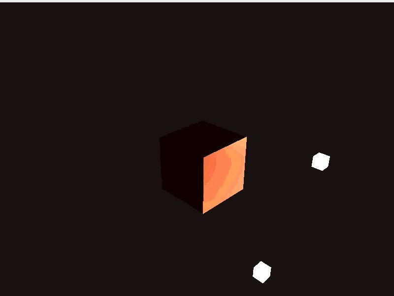
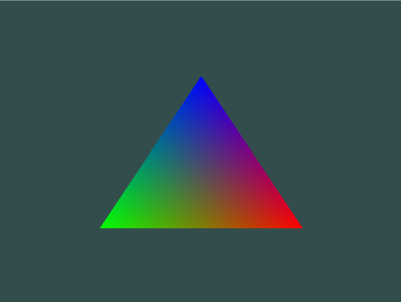
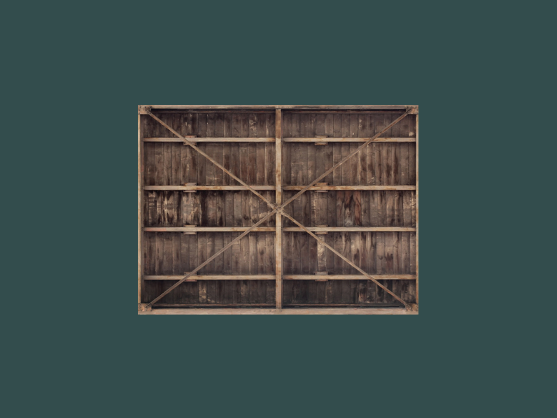
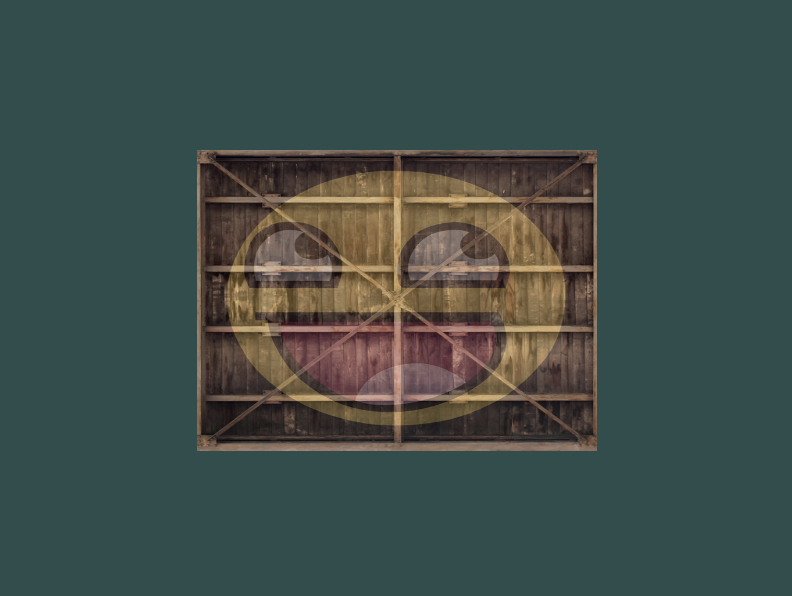
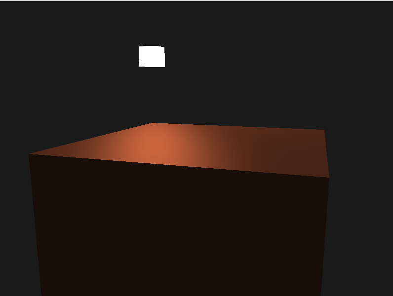
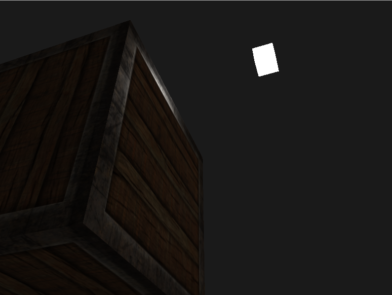

# LearnOpenGL Project

This is a hands-on learning project where I explore Modern OpenGL step by step. Instead of using game engines, I am implementing rendering techniques directly with OpenGL to better understand how real-time graphics work at a lower level. The repository tracks my progress as I move from basic rendering to more advanced lighting and shading techniques.

## Table of Contents

- [Demo showcase](#demo-showcase)
- [Features](#features)
- [Progress](#progress)
- [Credits](#credits)
- [License](#license)

## Demo showcase

Demonstration of the latest version:

## Features

- Core OpenGL rendering pipeline (VAO, VBO, EBO)
- GLSL shaders (vertex + fragment)
- Texture loading (stb_image)
- Camera (FPS-style: WASD + mouse; scroll zoom)
- Transformations (model / view / projection using GLM)
- Phong lighting: ambient, diffuse, specular

## Progress

### Getting Started

#### Hello Triangle

Starting the project with a triangle as a 'Hello, world!'

#### Shaders

Adding shaders

#### Textures

Different textures layered on one another

#### Transformations

Translating, scaling and rotating different objects around the scene

#### Coordinates

Adding a coordinate system

#### Camera

Free camera to move around

### Lighting

#### Basic Lighting

Phong lighting

#### Different Materials

How different materials interact differently with light

#### Lighting Maps

Using textures to give the object more realistic lighting properties

## Credits

This project follows the structure and concepts presented in:

Joey de Vries — *LearnOpenGL*  
https://learnopengl.com/

All core concepts and many implementation patterns are derived from the tutorial.  
This repository represents my personal implementation/experimentation while studying the material.

## License

Copyright (c) 2026 Paolo Orguim.

Permission is hereby granted, free of charge, to any person obtaining a copy of this software and associated documentation files (the "Software"), to deal
in the Software without restriction, including without limitation the rights to use, copy, modify, merge, publish, distribute, sublicense, and/or sell
copies of the Software, and to permit persons to whom the Software is furnished to do so, subject to the following conditions:

The above copyright notice and this permission notice shall be included in all copies or substantial portions of the Software.

THE SOFTWARE IS PROVIDED "AS IS", WITHOUT WARRANTY OF ANY KIND, EXPRESS OR IMPLIED, INCLUDING BUT NOT LIMITED TO THE WARRANTIES OF MERCHANTABILITY,
FITNESS FOR A PARTICULAR PURPOSE AND NONINFRINGEMENT. IN NO EVENT SHALL THE AUTHORS OR COPYRIGHT HOLDERS BE LIABLE FOR ANY CLAIM, DAMAGES OR OTHER
LIABILITY, WHETHER IN AN ACTION OF CONTRACT, TORT OR OTHERWISE, ARISING FROM, OUT OF OR IN CONNECTION WITH THE SOFTWARE OR THE USE OR OTHER DEALINGS IN THE
SOFTWARE.

